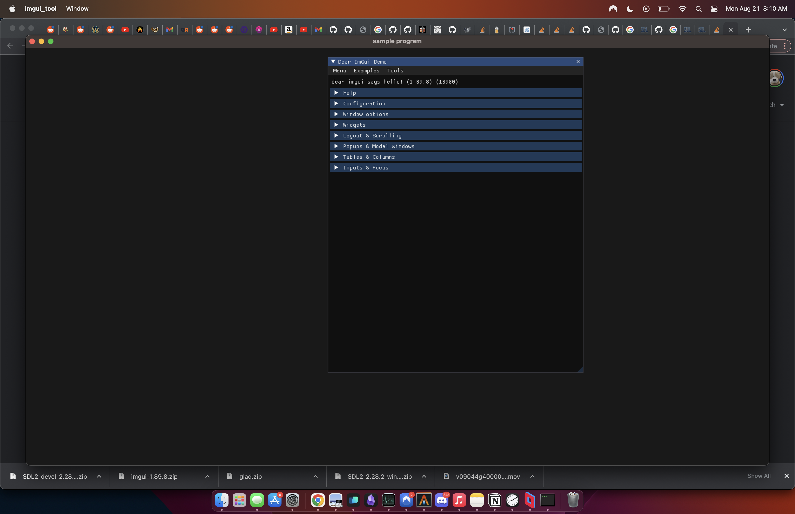

# tiny imgui package to make desktop apps with.

As it turns out imgui comes with an SDL2 renderer implementation.

This means you can make a very simple desktop app without needing any
graphics apis, the makefile is braindead simple,

Only tested this on macos m2 silicon so far, but the makefile is braindead simple and probably really easy to replicate.


build command: 

```
make && build/imgui_tool
```

[]


